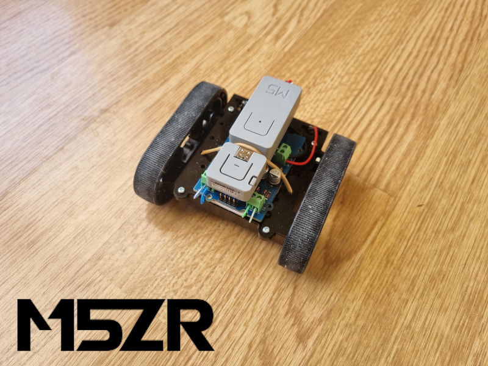
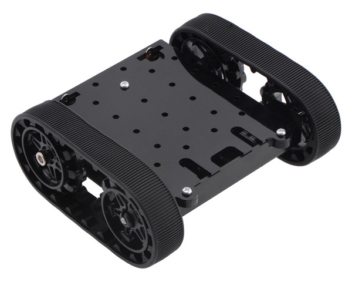
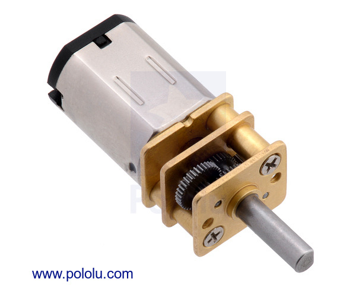
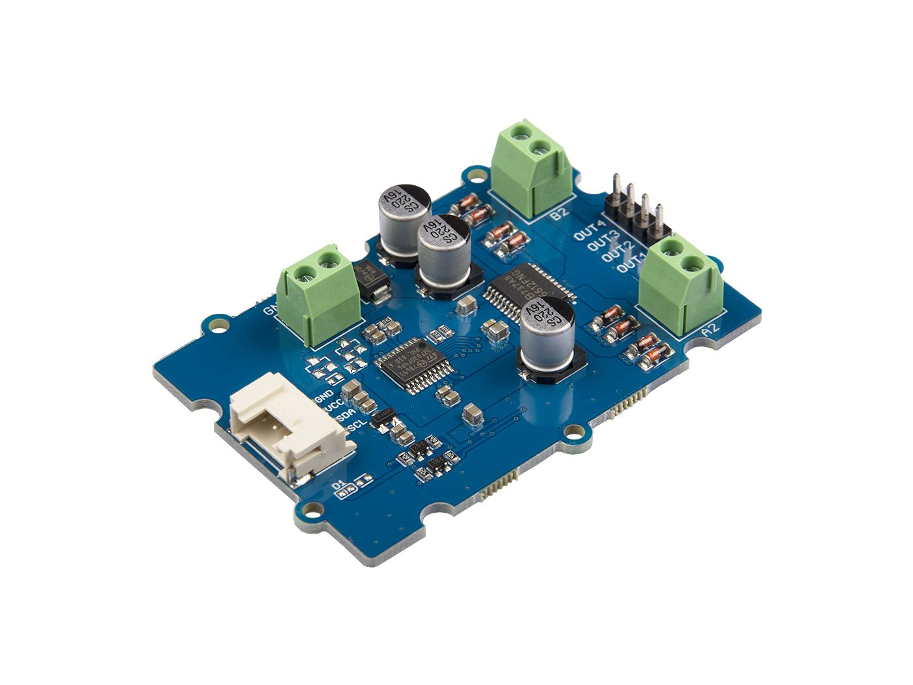
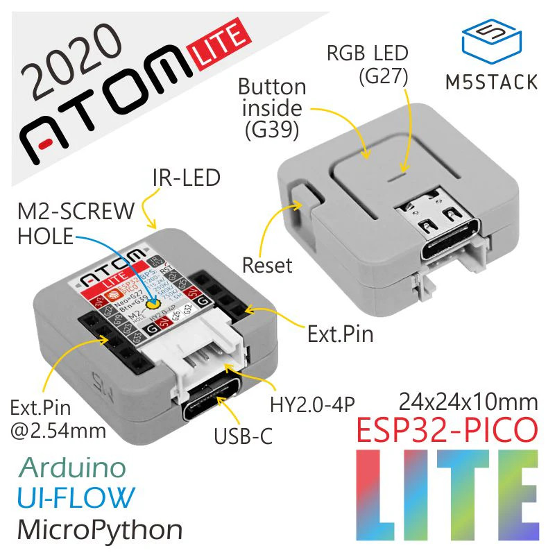
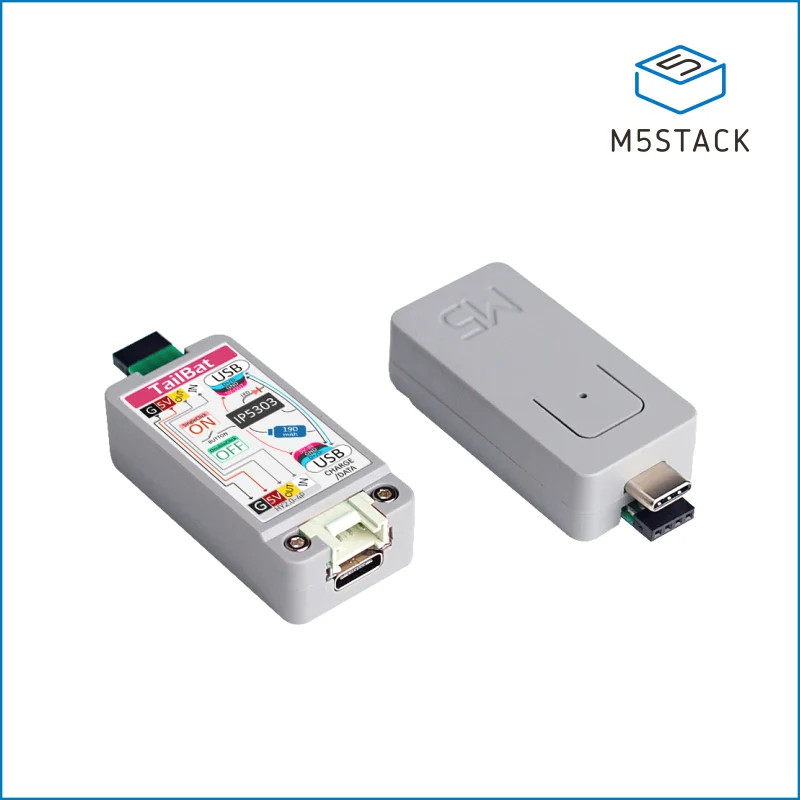

# M5ZR: M5 Zumo Rover

Rover controlled by M5Atom or M5StickC

## Materials
- [1x Zumo Chassis Kit](https://www.pololu.com/product/1418) 
- [2x Micro Metal Gearmotor HP 6V](https://www.pololu.com/product/1101) 
- [Grove - I2C Motor Driver](https://www.seeedstudio.com/Grove-I2C-Motor-Driver-TB6612FNG-p-3220.html) 
- [M5Atom](https://shop.m5stack.com/products/atom-lite-esp32-development-kit) 
- [Atom TailBat](https://shop.m5stack.com/products/atom-tailbat) 
- [A bluetooth gamepad supported by BluePad32 for Arduino](https://gitlab.com/ricardoquesada/bluepad32-arduino) 

